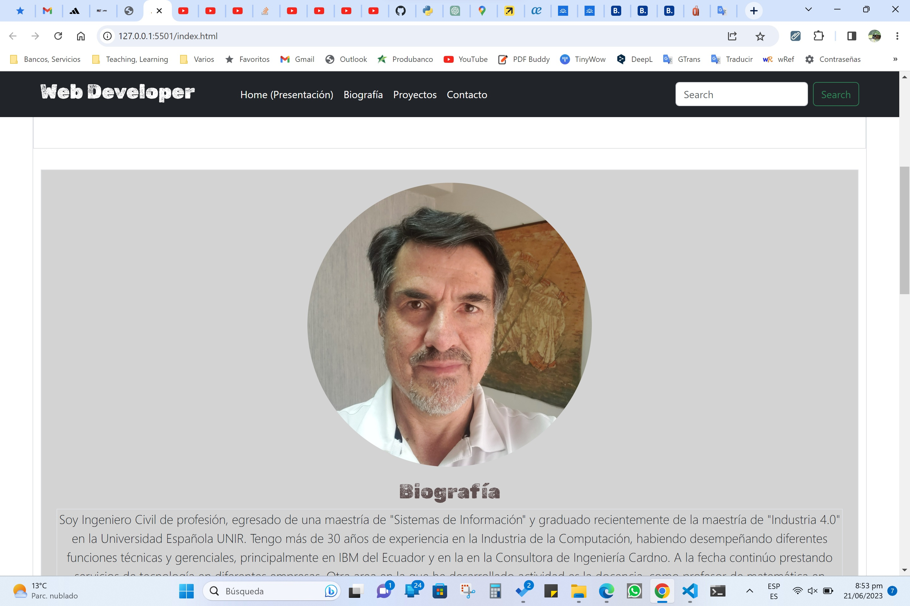

# 01-GithubPortfolioProject - Alberto Jácome


> :smile:**Proyecto de Portafolio**
>
> *Landing Page con:*

>> Presentación

>> Biografía

>> Proyectos:

>>> 0107-PacMenFactory https://github.com/betoje/0107-PacMenFactory

>>> 0108-EyeMovement https://github.com/betoje/0108-EyeMovement

>>> 0109-RealtimeBusTracker https://github.com/betoje/0109-RealTimeBusTracker
  
---



---

<div align="center" id="top"> 
  
  &#xa0;
</div>

<!-- 
<h1 align="center">01-GithubPortfolioProject</h1>
-->

<p align="center">
  
  
  
  
  
  
</p>

<p align="center">
  <a href="#dart-acerca">Acerca</a> &#xa0; | &#xa0; 
  <a href="#sparkles-caracteristicas">Caracteristicas</a> &#xa0; | &#xa0;
  <a href="#rocket-tecnologias>Tecnologias</a> &#xa0; | &#xa0;
  <a href="#white_check_mark-requerimientos">Requerimientos</a> &#xa0; | &#xa0;
  <a href="#checkered_flag-instrucciones">Instrucciones</a> &#xa0; | &#xa0;
  <a href="#memo-licencia">Licencia</a> &#xa0; | &#xa0;
  <a href="https://github.com/betoje" target="_blank">Autor</a>
</p>

---

<!--

[](http://hits.dwyl.com/betoje/01-GithubPortfolioProject)


-->

## :dart: Acerca ##

Proyecto de Portafolio

## :sparkles: Caracteristicas ##

Landing page con: 

   :ballot_box_with_check: Presentación
   
   :ballot_box_with_check: Biografía
   
   :ballot_box_with_check: Proyectos

## :rocket: Tecnologias ##

Los siguientes lenguajes/herramientas fueron usados en este proyecto:

- JavaScript, HTML, CSS
- Bootstrap 

## :white_check_mark: Requerimientos ##

Antes de empezar :checkered_flag:, se necesita tener [Git](https://git-scm.com) instalado.

## :checkered_flag: Instrucciones ##

```bash
# Clone este proyecto
$ git clone https://github.com/betoje/01-GithubPortfolioProject.git

# Acceda al directorio
$ cd 01-GithubPortfolioProject

# Arrastre el archvo index.html a su navegador de elección
```
## :memo: Licencia ##

Este proyecto está bajo la licencia de MIT. Para mayores detalles vea el archivo [LICENSE](LICENSE).

---

<!--
[](http://commonmark.org)
-->

  por <a href="https://github.com/betoje" target="_blank">Alberto Jacome</a>
 :heart: &#xa0;

<a href="#top">Regresar al inicio</a>
